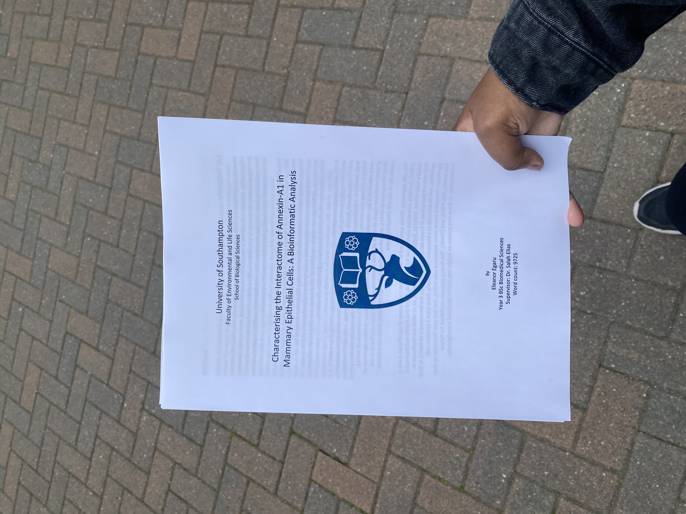
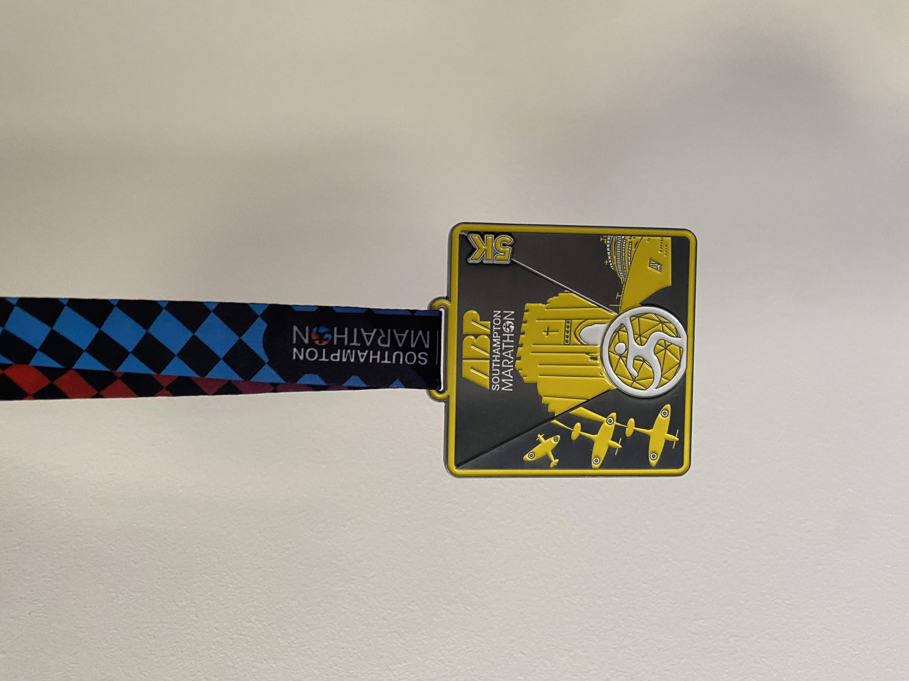
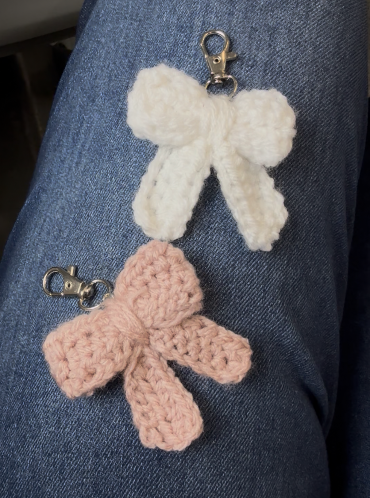

# About me

My name is Eleanor, and I'm an online Health Data Science student at the University of Exeter. 

  

- 🌱 I’m currently learning how to use git and github
- 🩷 I'm interested in Edtech, data science and bioinformatics, specifically learning about how data can be used in healthcare for predictive analysis and precision medicine.

- 🎹 My hobbies include running, reading, playing piano, crocheting and playing on my VR headset!

   

- 📍 Based in London, UK
